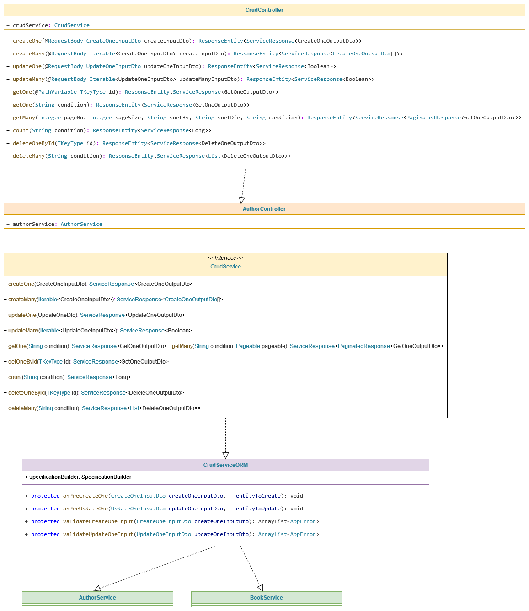

# XRest
A REST accelerator library. It allows for creating CRUD Controller and express conditions in JSON notation

# Why XRest ? Another CRUD Controller ?
The available solutions on the net doesn't offer a powerful expressive way to declare the conditions. <br/>
A truly CRUD Controller, should offer:<br/>
    1. a generic based version that does the heavy workload.<br/>
    2. a fully customizable solution based on business requirements.<br/>
    3. a robust expressive way of WHERE conditions.<br/>

# Prerequisites
1. Java 17 or higher ([Lebrica JDK](https://bell-sw.com/pages/downloads/#jdk-17-lts) is recommended here)
2. [Maven](https://maven.apache.org/download.cgi) 3.9.2 or higher
3. [Spring Boot](https://spring.io/projects/spring-boot) 

# Supported Database
Principally, XRest is supposed to work on any Sql-based database (PgSql, MySql or Microsoft Sql Server). 

# How to build
```bash
mvn clean package
```


# How to test 
```bash
mvn test
```

while testing the project, I recommend you test using the test runner of IntelliJ Idea Community Edition.
Each test case will output explanatory messages. 

### About testing project:
It is a Spring Boot web app, that starts the journey with you:
1. How to Design an entity in both ways (utilize XRest Base classes, and freely design your entity).
2. Shows how to design DTO classes.
3. Shows how to write mapper.
4. Shows how to write your repository classes.
5. Shows how to write your custom service classes and write custom business validation rules as well as create/update/delete hooks.
6. Shows you the power of `JSON Condition` and how to pass it to the API.
7. Shows how to write your controller classes.
8. Shows how to form `JSON Condition` in case of relation (ONE-TO-ONE, ONE-TO-MANY, MANY-TO-MANY). 

The test project test cases:
1. AuthorControllerTest it has 16 test cases. It shows how to utilize XRest base entities.
2. BookControllerTest it has 13 test cases. It show how your freely designed entities fit into XRest.
3. AuthorAndBookControllerTest it has 3 test cases mainly for how to deal with relation.

If you have further test cases that needs to be addressed, just drop me an email or open an issue.

[The test project source code](src/test/java/org/malsati/controllers_test/ContollersTestsSuite.java)


## Expressing Where Condition
The Where condition is in JSON notation. It allows you to express a business filter in JSON format.
Whether you need this condition in the API, Service Layer or Infrastructure Layer.

The Structure:
    It can have one of these two forms:

    1. LHS/RHS format:
    {
        "op": ...,
        "lhs": ...,
        "rhs": ...        
    }

    This is used with Binary operators, where:
    op: operator type ( <, =, <=, >, >=, !=, like )
    lhs: left hand side, should be the entity field name.
    rhs: right hand side, should be the value

    example1:
    {
        "op": "like",
        "lhs": "title",
        "rhs": "%Harry Potter%"
    }
    => all entities which have a title similar to the form: %Harry Potter%

    example2:
    {
        "op": ">",
        "lhs": "age",
        "rhs": 18
    }
    => all entities which have an age higher than 18

    If the type of the rhs is not scalar, you need to provide a hint what is it through the "type" key.
    for example:

    example3:
    {
        "op": ">",
        "lhs": "publishDate",
        "rhs": "2009-01-01",
        "type": "Date"
    }
    => all entities whose publishDate is after 2009-01-01

    2. RANGE format:
    This is used with Ternary operators, where:
    op: operator type ( between )
    lhs: left hand side, should be the entity field name.
    range1: the start of the range
    range2: the end of the range
    
    example4:
    {
        "op": "between",
        "lhs": "deathDate",
        "range1": "1999-06-01",
        "range2": "2003-12-01",
        "type": "Date"
    }
    => all entities whose deathDate is in the range inclusive [1999-06-01 , 2003-12-01]

    example5:
    {
        "op": "between",
        "lhs": "age",
        "range1": 18,
        "range2": 28
    }
    => all entities whose age is in the range inclusive [18, 28]

    example6:
    {
        "op": "&&",
        "lhs": {
            "op": "between",
            "lhs": "publishDate",
            "range1": "1999-06-01",
            "range2": "2003-12-01",
            "type": "Date"
        },
        "rhs": {
            "op": "||",
            "lhs": {
                "op": "like",
                "lhs": "name",
                "rhs": "% of %"
            },
            "rhs": {
                "op": ">",
                "lhs": "noPages",
                "rhs": 800
            }
        }
    }
    => all entities that:
            has been published in the range inclusive [1999-06-01 , 2003-12-01]
            and 
                either 
                       its name is similar to the token " of " 
                    or its number of pages is more than 800

    example7
    {
        "op": "=",
        "lhs": "books.title",
        "rhs": "Artificial Intelligence"
    }
    
    => All the authors who authored the book of title: 'Artificial Intelligence'
    Notice that the Author has a relation Many To Many to Book entity 
    and there is a list inside the Author called books
    This will allow you to query for nested entities inside the root entity
    The nesting level is infinite as long as there is a relation.


### The CRUD Endpoints
The following CRUD endpoints are supported:<br/>
    1. /getOne  ( condition can be passed ) <br/>
    2. /getMany ( condition can be passed ) <br/>
    3. /count  ( condition can be passed )<br/>
    4. /createOne <br/>
    5. /createMany <br/>
    6. /updateOne <br/>
    7. /updateMany <br/>
    8. /deleteOne <br/>
    9. /deleteMany ( condition should be passed ) <br/>

### How to use this library ?
1) Design your entity 
2) Design CRUD endpoints DTOs
3) Write down your entity mapper interface
4) Design your repository
5) Write down you service class
6) Write your CRUD Controller
7) In your project, there must be a configuration file that tells the app to scan the package: `org.malsati.xrest`

## 1) Design your entity
When designing your entity, you have two options:

1. Make use of the list of interfaces and base entities offered by XRest. [read more](#dexrest)
2. Design your entity freely without any utilization of XRest base classes or interfaces. [read more](#defreely)

### <a id="dexrest"></a> Interfaces and base entities offered by XRest:
When coming to business requirements, `Audit Info` are of three types:
1. Creation info:
   - who created the entity
   - when it has been created
2. Update info:
   - who updated the entity
   - when it has been updated
3. Delete info: (soft delete only)
   - who deleted the entity
   - when it has been deleted

`XRest` offers a list of base classes to cover this:<br/><br/>
<blockquote style="background-color:rgb(252, 252, 252); ">

`CreateEntity`: for entities that needs only creation info of the entity.

<details>
    <summary>example:</summary>
<blockquote style="background-color: transparent; ">

```java
@Data
@Entity
@Table(name = "City")
public class City extends CreateEntity {
    private String name;
    private String isoCode;
}
```
</blockquote>
</details>
</blockquote>

<br/>

<blockquote style="background-color:rgb(250, 250, 250); ">

`UpdateEntity`: for entities that needs only update info of the entity.

<details>
    <summary>example:</summary>
    <blockquote style="background-color: transparent; ">

```java
@Data
@Entity
@Table(name = "MessageItem")
public class MessageItem extends UpdateEntity {
    private String contents;
    private String senderName;
}
```
</blockquote>
</details>
</blockquote>

<br/>

<blockquote style="background-color:rgb(252, 252, 252); ">

`DeleteEntity`: for entities that needs only delete info of the entity.

<details>
    <summary>example:</summary>
    <blockquote style="background-color: transparent; ">

```java
@Data
@Entity
@Table(name = "Color")
public class Color extends DeleteEntity {
    private String rgbValue;
}
```
</blockquote>
</details>
</blockquote>
<br/>
<blockquote style="background-color:rgb(250, 250, 250); ">

`AuditEntity`: for entities that needs creation info as well as update info.

<details>
<summary>example:</summary>
<blockquote style="background-color: transparent; ">

```java
@Data
@Entity
@Table(name = "Report")
public class Report extends AuditEntity {
    private String title;
    private String content;
}
```
</blockquote>
</details>
</blockquote>
<br/>
<blockquote style="background-color:rgb(252, 252, 252); ">

`FullAuditEntity`: for entities that needs all the audit information (creation, update and delete).


<details>
<summary>example:</summary>
<blockquote style="background-color: transparent; ">

```java
@Data
@Entity
@Table(name = "Contract")
public class Contract extends FullAuditEntity {
    private String startDate;
    private String endDate;
}
```
</blockquote>
</details>
</blockquote>

### <a id="defreely"></a> Freely design your own entitities:
You can also design your own entity without any constraints.

for example: 

```java
@NoArgsConstructor
@Data
@Entity
@Table(name = "Author")
public class Author {
    @Id
    @GeneratedValue(strategy = GenerationType.IDENTITY)
    protected Long id;

    @Column(name = "full_name", unique = true)
    private String fullName;

    @Column(name = "birth_date")
    private LocalDate birthDate;
}
```
Notice that here no XRest base entities is used.

Note: There are a list of Audit interfaces that are considered the contracts of auditing. They might be useful in some situations:
`CreationInfo`
`UpdateInfo`
`DeletionInfo`
`IdentityInfo`

#### Soft Delete Note:
When you want your entity to be soft-deleted, make sure you implement the interface: `DeletionInfo`.

CRUD operations will support `Soft Delete` automatically when you implement this interface.

If your entity doesn't implement this interface, `Hard Delete` will be chosen by XRest.

## 2) Design CRUD endpoints DTOs

#### CreateOne Endpoint (CreateOneInputDto, CreateOneOutputDto)

```java
@Data
@AllArgsConstructor
@NoArgsConstructor
public class CreateOneAuthorInputDto {
    private String fullName;
    private LocalDate birthDate;
    private Collection<Long> bookIds;
}
```
```java
@Data
@AllArgsConstructor
@NoArgsConstructor
public class CreateOneAuthorOutputDto extends CreateOneAuthorInputDto {
    private Long id;

    public CreateOneAuthorOutputDto(Long id, String fullName, LocalDate birthDate, Collection<Long> bookIds) {
        super(fullName, birthDate, bookIds);
        this.id = id;
    }
}
```

#### UpdateOne Endpoint (UpdateOneInputDto)
```java

public class UpdateOneAuthorInputDto extends CreateOneAuthorOutputDto implements IdentityInfo<Long> {  
}
```

### note:
When writing your `UpdateOneInputDto` you need to implement the interface `IdentityInfo` so that XRest will know how to retrieve the ID of the entity.
The ID of the entity is used by XRest to do basic validation before doing the actual update of the entity.
This validation is common to all entities though.


#### GetOne Endpoint (GetOneInputDto)
```java
public class GetOneAuthorOutputDto extends CreateOneAuthorOutputDto {
}
```

#### DeleteOne Endpoint (DeleteOneOutputDto)
```java
public class DeleteOneAuthorOutputDto extends UpdateOneAuthorInputDto {
}
```

## 3) Write down your entity mapper interface
It should inherit from IMapper

```java
@Mapper(componentModel = "spring")
public interface AuthorMapper extends IMapper<Author,
        Long,
        CreateOneAuthorInputDto,
        CreateOneAuthorOutputDto,
        UpdateOneAuthorInputDto,
        DeleteOneAuthorOutputDto,
        GetOneAuthorOutputDto> {

    @Override
    @Mapping(source = "bookIds", target = "books")
    Author createOneInputDtoToEntity(CreateOneAuthorInputDto createOneAuthorInputDto);
    
    @Override
    @Named("createOne")
    @Mapping(source = "books", target = "bookIds")
    CreateOneAuthorOutputDto entityToCreateOneOutputDto(Author entity);
    
    @Override
    List<Author> createManyInputDtoToEntities(Iterable<CreateOneAuthorInputDto> createManyInputDto);
    
    @Override
    @IterableMapping(qualifiedByName = "createOne")
    List<CreateOneAuthorOutputDto> entitiesToCreateManyOutputDto(List<Author> entities);
    
    @Override
    @Mapping(source = "bookIds", target = "books")
    Author updateOneInputDtoToEntity(UpdateOneAuthorInputDto updateOneAuthorInputDto);
    
    @Override
    @Mapping(source = "books", target = "bookIds")
    DeleteOneAuthorOutputDto entityToDeleteOneOutputDto(Author entity);
    
    @Override
    List<DeleteOneAuthorOutputDto> entitiesToDeleteManyOutputDto(List<Author> entity);
    
    @Override
    @Mapping(source = "books", target = "bookIds")
    GetOneAuthorOutputDto entityToGetOneoutputDto(Author entity);

    default List<Book> mapBookIdsToBooks(Collection<Long> bookIds) {
        var books = new ArrayList<Book>(bookIds.size());
        for (Long id: bookIds) {
            books.add(new Book(id));
        }
        return books;
    }

    default List<Long> mapBooksToBookIds(Collection<Book> books) {
        var bookIds = new ArrayList<Long>(books.size());
        for (var book: books) {
            bookIds.add(book.getId());
        }
        return bookIds;
    }
}
```

[Show me how (first case)](src/test/java/org/malsati/simple_web_app/mapper/AuthorMapper.java) <br />
[Show me how (second case)](src/test/java/org/malsati/simple_web_app/mapper/BookMapper.java)

## 4) Design your repository
Make sure you inherit from `JpaRepository` as well as `JpaSpecificationExecutor` : 
```java
public interface AuthorRepository extends JpaRepository<Author, Long>, JpaSpecificationExecutor<Author> {
    boolean existsByFullName(String name);
}
```

## 5) Write down your service class:
1. It should extend CrudServiceORM
2. In its constructor, it should inject the entity 
   repository and the mapper you've created in previous steps.
3. Implement the validation methods `validateCreateOneInput` and `validateUpdateOneInput` if needed (optional)
4. Implement the hooks `onPreCreateOne`, `onPreUpdateOne` and `onPreDeleteOne` if needed (optional)

[Show me how (first case)](src/test/java/org/malsati/simple_web_app/service/AuthorsService.java) <br />
[Show me how (second case)](src/test/java/org/malsati/simple_web_app/service/BookService.java)


```java
@Service
public class AuthorsService extends CrudServiceORM<
        Author,
        Long,
        CreateOneAuthorInputDto,
        CreateOneAuthorOutputDto,
        UpdateOneAuthorInputDto,
        DeleteOneAuthorOutputDto,
        GetOneAuthorOutputDto> {
    
    public AuthorsService(
            AuthorRepository authorRepository,
            AuthorMapper mapper) {
        super(authorRepository, mapper);
    }

    @Autowired
    BookRepository bookRepository;    

    @Override
    public ArrayList<AppError> validateCreateOneInput(CreateOneAuthorInputDto createOneAuthorInputDto) {
        // Write down your own validation for the input Dto
    }

    @Override
    protected void onPreCreateOne(CreateOneAuthorInputDto createOneAuthorInputDto, Author entityToCreate) {
        // Write down any Business Specific Logic Here before the entity is saved to DB
    }

    @Override
    public Pair<ArrayList<AppError>, Author> validateUpdateOneInput(UpdateOneAuthorInputDto updateOneAuthorInputDto) {
        // Write down your own validation for the input Dto
    }

    @Override
    protected void onPrUpdateOne(UpdateOneAuthorInputDto updateOneAuthorInputDto, Author author) {
        // Write down any Business Specific Logic Here before the entity is saved to DB
    }
}
```

## 6) Write your CRUD Controller:
1. It should inherit from CRUDController<br/>
2. It should pass the service class you've created in previous step

```java
@RequestMapping("/app/author")
@RestController
public class AuthorsController extends CrudController<Author,
        Long,
        CreateOneAuthorInputDto,
        CreateOneAuthorOutputDto,
        UpdateOneAuthorInputDto,
        DeleteOneAuthorOutputDto,
        GetOneAuthorOutputDto> {
    public AuthorsController(AuthorsService authorsService) {
        super(authorsService);
    }
}
```

## 7) Mandatory Configuration in your web project:
make sure you add this configuration to tell Spring to scan for XRest components:

```java
@Configuration
@ComponentScan(basePackages = "org.malsati.xrest")
public class ApplicationConfig {
}
```




### Roadmap
1. xrest.cli (progress)
2. JSON schema validation (todo)
